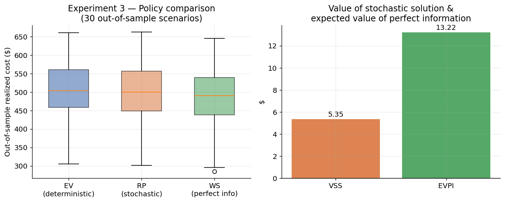
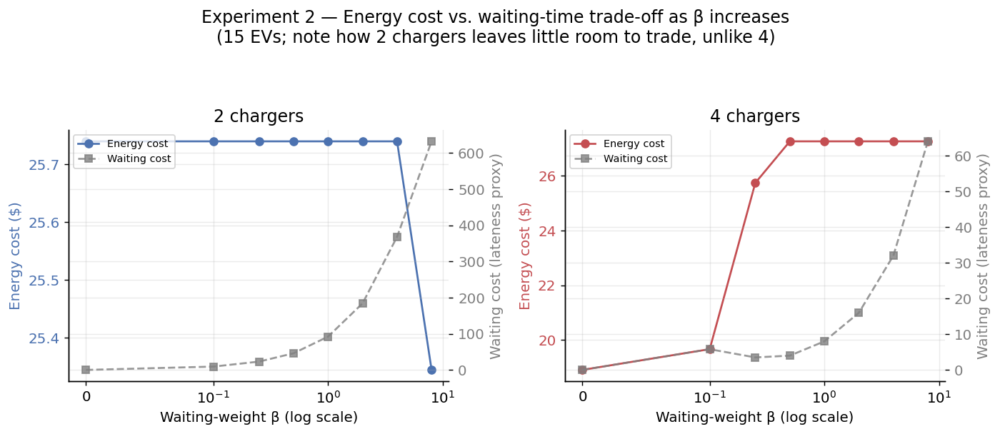
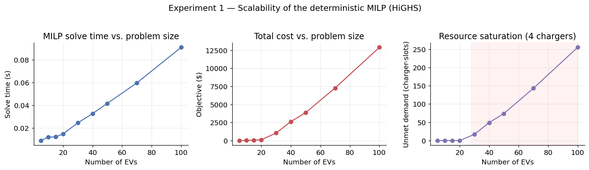

# Mixed-Integer Optimisation for EV Charging Allocation

EV charging allocation formulated as a **mixed-integer optimisation /
resource-constrained scheduling problem**, extended to an
**uncertainty-aware two-stage stochastic framework**, with computational
experiments comparing solution quality, feasibility, and cost under
uncertainty. Solved with the open-source **HiGHS** solver via
`scipy.optimize.milp`.

Full methodology, formulation and results discussion: **[REPORT.md](REPORT.md)**.

## Results at a glance

**Value of the stochastic solution.** A plan that hedges against uncertain
arrival times / energy demand (RP) beats a plan built from a single point
forecast (EV) when both are stress-tested out-of-sample, with a measurable
remaining gap to a clairvoyant scheduler (WS):



**Resource scarcity shapes the cost/waiting trade-off.** With only 2
chargers there's almost no room to trade energy cost for waiting time;
with 4 chargers there's real flexibility:



**Scalability.** The deterministic MILP solves in well under 0.1s up to
100 EVs, with cost growing super-linearly once chargers saturate:



More figures (SAA convergence, an example solved schedule) are in
[`figures/`](figures/) and discussed in [REPORT.md](REPORT.md).

## Structure

```
src/
  data_gen.py             synthetic EV arrival / demand / price data + scenario sampling
  deterministic_model.py  deterministic MILP (resource-constrained scheduling)
  stochastic_model.py     two-stage stochastic MILP (scenario-based recourse)
  evaluate.py              out-of-sample evaluation, VSS / EVPI metrics
  experiments.py           the four computational studies (run this)
  visualize.py              all figures (run this after experiments.py)
results/                   CSV outputs of every experiment
figures/                    PNG figures referenced in REPORT.md
REPORT.md                   full write-up: formulation, methodology, results
```

## Quickstart

```bash
git clone <this-repo>
cd ev_charging_opt
pip install -r requirements.txt
cd src
python experiments.py   # writes results/*.csv
python visualize.py     # writes figures/*.png
```

## What's implemented

1. **Mixed-integer formulation** (`deterministic_model.py`) — binary
   charger/time-slot assignment variables, charger-capacity, time-window
   and energy-demand constraints, with an unmet-demand slack.
2. **Resource-constrained scheduling framing** (`experiments.py`,
   Experiment 2) — chargers as unary resources; explicit Pareto study of
   energy cost vs. waiting time vs. resource availability.
3. **Uncertainty-aware extension** (`stochastic_model.py`) — two-stage
   stochastic MILP (extensive form) over sampled arrival-time / demand
   scenarios, with a recourse penalty for deviating from the committed plan.
4. **Computational experiments** (`experiments.py`, `visualize.py`) —
   scalability, cost/waiting trade-off, out-of-sample policy comparison
   (VSS/EVPI), and SAA convergence.
